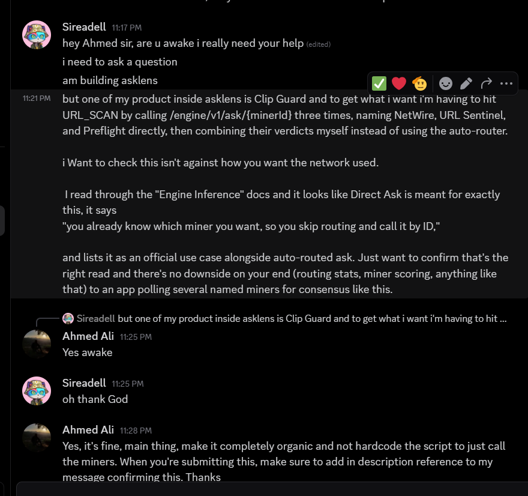
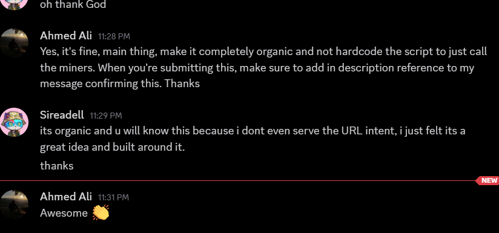

# AskLens

> **Live safety checks where you act.**

Live safety checks for the copied link, copied wallet address, or AI answer
you're about to trust. AskLens brings live Telegraph intelligence to those
moments without making you leave the workflow you are in.

| Start here | Link |
|---|---|
| ClipGuard for Windows | [Open ClipGuard](https://asklens-zoox.onrender.com/pc.html) |
| Wallet safety in MetaMask | [Open the Snap guide](https://asklens-zoox.onrender.com/metamask.html) |
| Use from Claude or Cursor | [Open the MCP setup guide](https://asklens-zoox.onrender.com/connect.html) |
| Source code | [github.com/Sireadell/asklens](https://github.com/Sireadell/asklens) |
| Hackathon | Telegraph Season I, Track 3 Applications |

**AskLens is not another search website.** It puts live Telegraph intelligence
in the clipboard, wallet, and AI tools where people already decide what to
trust.

## The dangerous moment is the copy

Copying an address is often the last pause before money moves. Clipboard
hijacking can replace a copied address, and address-poisoning scams use a
lookalike address to tempt someone into copying the wrong one. A copied link
has the same problem: by the time a person thinks to check it, they may already
have opened it.

ClipGuard checks a complete copied web link or `0x` wallet address and sends a
Windows notification when the result is ready.

## One link, three live opinions

For a copied web link, ClipGuard asks **NetWire, URL Sentinel, and Preflight**
through Telegraph. Their answers become one result, and ClipGuard shows which
miners answered. Disagreement is visible. It is not hidden behind a single
confident label.

A copied wallet address gets a live fraud request through Telegraph. Telegraph
routes it, and AskLens shows the returned result and reason.

Only an item that is exactly a web link or `0x` wallet address is sent for
checking. Other copied text is ignored and never sent anywhere.

## Telegraph team feedback

Before shipping ClipGuard, we asked the Telegraph team how a multi-miner URL
safety check should use the network. Their guidance was to keep miner selection
organic, rather than hardcoding a script to keep calling the same miners. The
screenshots below are the original conversation.





## Three places, one intelligence layer

| Where you are | What AskLens does |
|---|---|
| Windows clipboard | ClipGuard checks a copied link or wallet address. |
| Claude, Cursor, or another MCP tool | AskLens brings live, source-backed information into the answer. |
| MetaMask | The AskLens Snap shows a live wallet-risk warning before approval. |

The person still decides what to do. AskLens supplies the live signal and its
reason.

## What a reviewer can verify

- ClipGuard fans a copied web link out to three live Telegraph URL-scan miners.
- ClipGuard sends a copied `0x` wallet address to Telegraph for a live fraud
  result, routed by the network.
- AskLens ships a Windows client, MetaMask Snap, and MCP setup flow.
- We run two Telegraph miners: TxLens (ID 9002) and Telegraph Sentinel
  (ID 94217603).
- The repository test suite passes with `npm test`.

## Run it locally

AskLens needs Node.js 20 or later.

```bash
npm ci
cp .env.example .env
# Add a Base Sepolia private key with testnet USDC to .env
npm start
```

On Windows PowerShell, use `Copy-Item .env.example .env` instead of `cp`.

Run the tests with:

```bash
npm test
```

To run ClipGuard from source:

```bash
cd clipguard-client
npm install
npm run watch
```

## Next: Solana token checks for traders

Traders often copy a Solana token address just before buying. The next
ClipGuard check will recognise that address and ask Telegraph for live
token-risk signals before the trade: rug-risk indicators, mint or freeze
authority, and holder concentration where a specialist miner can provide it.

The goal is simple: make the easiest safety check happen at the exact moment a
trader is deciding whether to buy.

## Network

AskLens uses Base Sepolia and testnet USDC, the Telegraph Season I test
environment. It does not move real money.

## Honest limits

- **AskLens informs decisions.** It does not block a browser, wallet, or AI
  action on its own.
- **Telegraph is the intelligence layer.** AskLens presents the live result
  returned by Telegraph, together with the supporting reason. It does not add
  certainty beyond the network response.
- **The Windows prototype is not code-signed yet.** Windows may warn about it,
  and Smart App Control can block it.

## License

[MIT](LICENSE)
